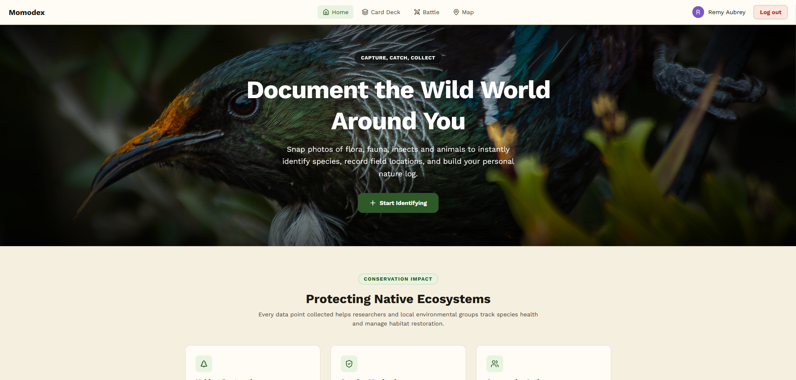
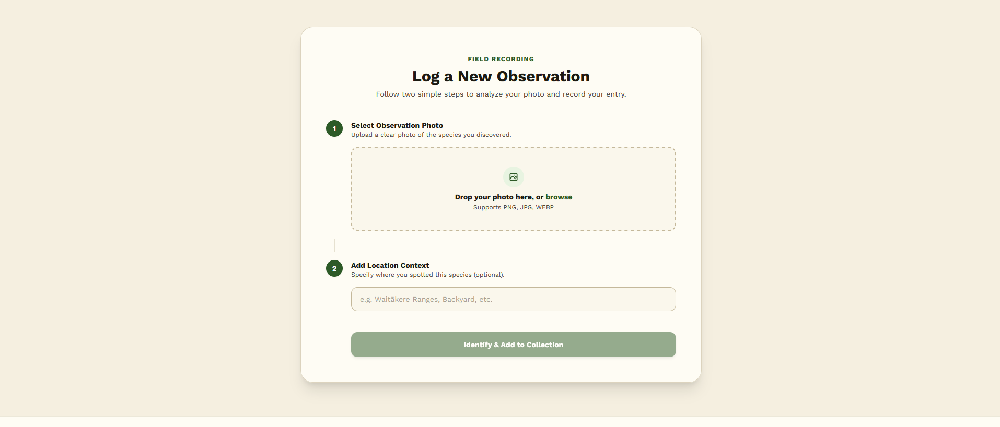
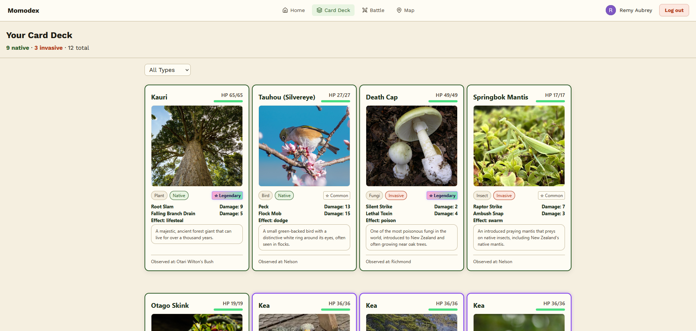
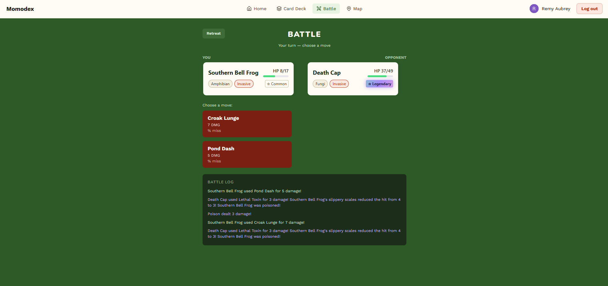
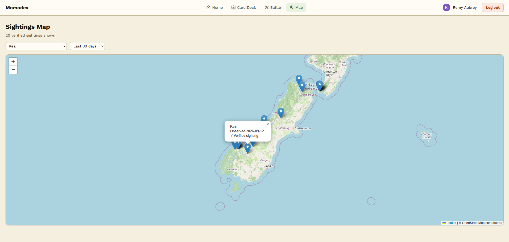
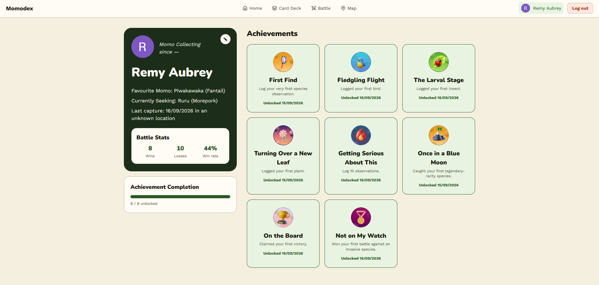

# 🥝 Momodex

A gamified citizen-science app that turns real-world nature observations into a collectible card and battle game — built to get more people outside, observing New Zealand's native and invasive species, and (eventually) contributing that data back to real conservation research.

Built as a one-week group project during our full-stack dev course.

---

## 🌱 What and Why is Momodex?

Momodex turns nature walks into a game: photograph a plant or animal, get it identified by AI, and collect it as a Pokémon-style trading card — complete with stats and abilities grounded in the species' real conservation status. Cards can be viewed on a map of real sightings pulled from iNaturalist, and battled against computer-controlled opponents.

The bigger goal behind the game is increasing the volume and quality of citizen-science observations of New Zealand wildlife. Real conservation research — tracking where native species live, catching new pest incursions early, monitoring population health — depends on ordinary people going outside and recording what they see. Most people have no particular reason to do that. Momodex gives them one: make it feel like collecting cards, and the data collection follows as a side effect of people having fun.

### Why iNaturalist?

iNaturalist is the global citizen-science platform this idea is built on — anyone can upload a wildlife photo, get it identified by experts and AI, and contribute the sighting to a public, research-grade database. New Zealand's Department of Conservation actively relies on it, treating public observations as a genuine part of their own monitoring pipeline rather than just outreach. Validated records also feed into GBIF, the international database researchers query directly. In short: a photo from someone's Sunday walk can end up in real scientific research.

Momodex doesn't submit to iNaturalist yet — identified photos currently stay in our own database. Closing that loop is the single highest-priority next step for the project (see Roadmap).

---

## 🌿 Observe Responsibly

Momodex only works if the underlying observations are made safely and respectfully — for the wildlife itself, not just for the data. Before you go out photographing:

- **Don't touch, move, feed, or handle wildlife** to get a better photo. If an animal changes its behavior because of you, you're too close or too involved.
- **Never remove, trample, or disturb plants** — including moving foliage aside for a clearer shot. Stay on marked trails where they exist.
- **Keep a respectful distance**, especially from nesting birds, den sites, or anything showing signs of stress (fleeing, distress calls, defensive posturing). A zoomed photo from further away beats a close one that disturbs the animal.
- **Never bait or lure wildlife** with food or sound to get it to appear or come closer.
- **Leave nests, burrows, and dens alone entirely** — do not approach, photograph up close, or linger near them, even from a distance that feels safe to you.
- **Be extra cautious around threatened and endangered species.** If you're not sure whether something is sensitive, treat it as if it is.
- **Respect posted rules** on private land, conservation areas, and reserves — some areas restrict access specifically to protect vulnerable species from disturbance.
- **Prioritize the animal or plant's wellbeing over getting the shot, every time.** A missed card is a fine trade-off; a stressed or displaced animal is not.


---

## ✨ Features

- **📸 Photo identification** — upload a photo of a plant or animal; Google's Gemini API identifies the species from a curated shortlist of native and invasive New Zealand species
- **🃏 Card collection** — every successful identification becomes a collectible card, complete with stats (HP, attack), rarity tier, and real conservation status (native / invasive)
- **⚔️ Turn-based battles** — battle your caught species against a randomly selected AI opponent, with:
  - Two unique attacks per species, each with its own accuracy (miss chance)
  - A rock-paper-scissors style type effectiveness system (bird → reptile/amphibian → insect → plant → fungi → mammal → bird)
  - Species-specific passive and on-attack effects: dodge, intimidate, slippery (damage reduction), poison (damage over time), lifesteal, and swarm (double hit)
  - A leveling system — species you've caught more often battle stronger
- **🗺️ Sightings map** — real, verified observation locations pulled live from the iNaturalist API, filterable by species and date range
- **🏆 Achievements** — unlockable badges for battle milestones and collection progress
- **🔐 Authentication** — secure login via Auth0, with JWT-protected API routes
- **🖼️ Cloud image hosting** — user-uploaded photos are stored via Cloudinary

---

## 🛠️ Tech Stack

**Frontend**
- React + TypeScript
- Vite
- Tailwind CSS + SCSS
- TanStack Query (React Query)
- React Router
- react-leaflet (map)
- Auth0 React SDK

**Backend**
- Node.js + Express
- Knex.js + SQLite
- Auth0 JWT validation (`express-oauth2-jwt-bearer`)
- Cloudinary SDK
- Superagent

**External APIs**
- [Google Gemini API](https://ai.google.dev/) — AI-powered species identification
- [iNaturalist API](https://api.inaturalist.org/) — real observation and sighting data

---

## 📸 Screenshots












---

## 🚀 Getting Started

### Prerequisites

- Node.js (v18+)
- npm
- A free [Cloudinary](https://cloudinary.com/) account
- A free [Google AI Studio](https://aistudio.google.com/) API key (for Gemini)
- A free [Auth0](https://auth0.com/) application (Single Page App + API configured)

### Installation

```bash
# Clone the repo
git clone <your-repo-url>
cd momodex

# Install dependencies
npm install
```

### Environment variables

Create a `.env` file in the project root with the following:

```dotenv
# --- Server-side only (never exposed to the browser) ---

# Gemini API
GEMINI_API_KEY=your_gemini_api_key

# Cloudinary
CLOUDINARY_CLOUD_NAME=your_cloud_name
CLOUDINARY_API_KEY=your_api_key
CLOUDINARY_API_SECRET=your_api_secret

# Auth0 (backend JWT validation)
AUTH0_DOMAIN=your_auth0_domain
AUTH0_AUDIENCE=your_auth0_audience

# --- Client-side (bundled into the frontend build — VITE_ prefix required) ---

VITE_AUTH0_DOMAIN=your_vite_auth0_domain
VITE_AUTH0_CLIENT_ID=your_vite_auth0_client_id
VITE_AUTH0_AUDIENCE=your_vite_auth0_audience
```

> Each team member running this locally needs their own `.env` file — it's git-ignored and never committed.
>
> **Note on the two Auth0 domain/audience pairs:** the `VITE_`-prefixed variables are bundled directly into the frontend JavaScript and are visible to anyone who opens the browser's dev tools — this is expected and fine for Auth0's public-facing config (domain, client ID, audience), since these values aren't secrets. The non-prefixed versions are used only by the backend to validate incoming JWTs and are never sent to the browser. Never put anything genuinely secret (like `CLOUDINARY_API_SECRET` or `GEMINI_API_KEY`) behind a `VITE_` prefix, since Vite will bundle it straight into publicly-readable client code.

### Database setup

```bash
# Run migrations
npx knex --knexfile ./server/db/knexfile.js migrate:latest

# Seed the database with species and user data
npm run knex seed:run
```

### Running the app

```bash
npm run dev
```

This starts both the Vite frontend and the Express backend concurrently. The app will be available at `http://localhost:5173`.

---

## 📁 Project Structure

```
├── client/              # React frontend
│   ├── Pages/            # Route-level pages
│   ├── components/       # Reusable and page-specific components
│   ├── apis/              # API client functions
│   ├── hooks/             # Custom React hooks
│   └── utils/             # Battle logic, helpers
├── server/               # Express backend
│   ├── routes/            # API route definitions
│   ├── services/          # Business logic / DB queries
│   └── db/                # Knex config, migrations, seeds
└── models/               # Shared TypeScript types
```

---

## ⚠️ A note on data accuracy

Species descriptions and fun facts were compiled during development from AI, general knowledge and public sources. Given this app's educational purpose, we'd recommend a fact-checking pass against authoritative sources (e.g. the [Department of Conservation](https://www.doc.govt.nz/) or [Landcare Research](https://www.landcareresearch.co.nz/)) before treating any specific fact as fully verified for public use.

---

## 🔭 Roadmap & Known Limitations

Momodex was built by a beginner team in one week as a course project — it's a working proof of concept, not a finished product. A few things were deliberately scoped out or simplified:

- **Data doesn't yet flow back to iNaturalist.** Right now, photos are identified via Google's Gemini API and stored in our own database — they aren't submitted to iNaturalist itself. Closing this loop (submitting verified observations back to iNaturalist, likely via their OAuth2 API, with the user's consent) is the single most important next step for actually achieving this project's core conservation goal, since right now the "citizen science" data collected stays siloed inside Momodex rather than reaching the researchers who could use it.
- **Only a subset of New Zealand species are currently identifiable.** Each species needed hand-designed stats, two named attacks, and a matching type/archetype to work in the battle system — that manual design work meant we started with a deliberately smaller list rather than every species users might photograph. Expanding this list (and ideally making it easier to add new species without manually adding stats) is a next step.
- **Battle mechanics are intentionally simple.** The current system covers basic type effectiveness, two attacks per species, a handful of elemental-style effects (poison, lifesteal, dodge, etc.), and a leveling system based on capture count — but opponent behavior is largely random rather than strategic, and there's plenty of room for deeper mechanics (status effect stacking, more varied decision-making, battling friends, multiplayer battles) if development continued.
- **Species facts and descriptions need a verification pass.** As noted above, content was written from general knowledge during a fast build and hasn't been checked against authoritative sources — worth doing before treating this as a public-facing educational resource.
- **No mobile app** — Momodex is a responsive web app, but a native mobile experience (with camera integration and offline capture) would likely increase real-world usage significantly, since most wildlife photography happens away from a desk.

---

## 🙏 Acknowledgments

- **[iNaturalist](https://www.inaturalist.org/)** and the New Zealand Bio-Recording Network Trust, for open access to real observation data
- **[New Zealand Department of Conservation](https://www.doc.govt.nz/)**, for conservation status information that informed our species data
- Everyone who's out there actually photographing and identifying New Zealand's wildlife — this app exists because of that community's work

---

## 👥 Team

Built by Remy Aubrey, Dominic De Torres, Morah Lopati, John Bardwell, and Levi Taylor, as part of Devacademy 2026 Hotoke cohort.

---

## 📄 License

This project was built for educational purposes as part of a dev course. 
